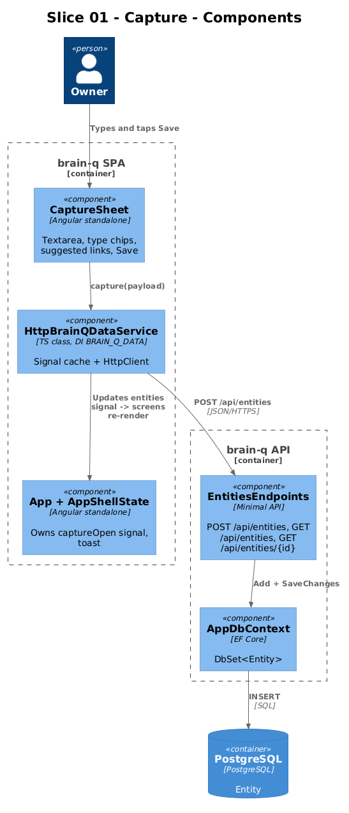
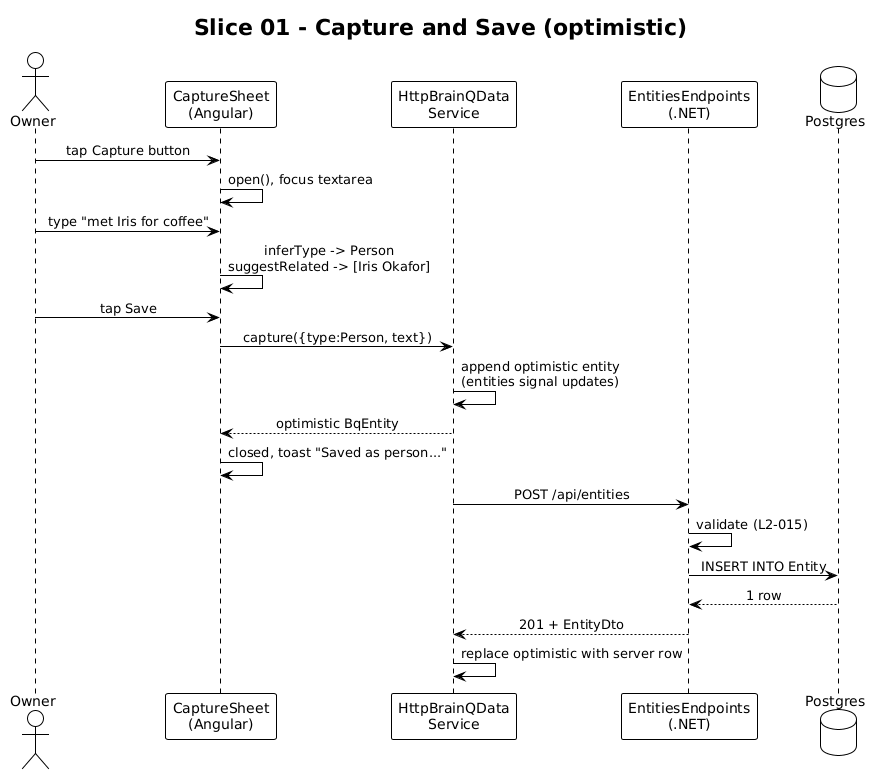

# Slice 01 — Entity Capture

**Traces to:** L2-001, L2-003 (POST), L2-011, L2-024, L2-015

## 1. Overview

The Capture sheet is the only write affordance the system ships with. Tap the global Capture button → sheet opens → type free-form text → optional manual type override → tap Save → an `Entity` row is persisted, the sheet closes, a confirmation toast appears, and the new entity is immediately visible in Today's "Recently touched" list and the Brain screen.

The frontend already implements the sheet UX against the in-memory data service. This slice swaps that implementation for an HTTP-backed one and adds the backend endpoints that satisfy the writes.

## 2. Architecture



Frontend changes are confined to one new file plus one provider swap. Backend additions are one endpoint file, one DTO record, and one DB context class.

### 2.1 Frontend changes (start from existing code)

| File | Change |
|---|---|
| `frontend/projects/domain/src/lib/api-base-url.token.ts` | **New** — `export const API_BASE_URL = new InjectionToken<string>('API_BASE_URL')` |
| `frontend/projects/domain/src/lib/http-data.service.ts` | **New** — `HttpBrainQDataService` implementing `BrainQDataService` |
| `frontend/projects/domain/src/lib/provide-domain.ts` | Add `provideBrainQHttpDomain({ baseUrl })` alongside existing `provideBrainQDomain()` |
| `frontend/projects/domain/src/public-api.ts` | Export `API_BASE_URL` and `provideBrainQHttpDomain` |
| `frontend/projects/brain-q/src/app/app.config.ts` | Replace `provideBrainQDomain()` with `provideBrainQHttpDomain({ baseUrl: '/api' })` and add `provideHttpClient()` |
| `frontend/projects/brain-q/src/app/components/capture-sheet/capture-sheet.html` | Add `data-testid` hooks (no behaviour change) |

`HttpBrainQDataService` keeps the synchronous `Signal<readonly BqEntity[]>` contract by hydrating on construction:

```ts
@Injectable()
export class HttpBrainQDataService implements BrainQDataService {
  private readonly http = inject(HttpClient);
  private readonly base = inject(API_BASE_URL);

  private readonly _entities = signal<readonly BqEntity[]>([]);
  private readonly _agenda  = signal<BqAgenda>(EMPTY_AGENDA);
  readonly entities = this._entities.asReadonly();
  readonly agenda   = this._agenda.asReadonly();

  constructor() {
    this.http.get<BqEntity[]>(`${this.base}/entities`)
      .subscribe(xs => this._entities.set(xs));
  }

  capture(payload: BqCapturePayload): BqEntity {
    const optimistic: BqEntity = makeOptimistic(payload);
    this._entities.update(xs => [optimistic, ...xs]);
    this.http.post<BqEntity>(`${this.base}/entities`, payload).subscribe({
      next: saved => this._entities.update(xs => xs.map(e => e.id === optimistic.id ? saved : e)),
      error: ()    => this._entities.update(xs => xs.filter(e => e.id !== optimistic.id)),
    });
    return optimistic;
  }
  // byId / inboundFor / heatmapFor / search / inferType / suggestRelated unchanged from in-memory shape
}
```

Inference (`inferType`) and suggestion (`suggestRelated`) **stay client-side** in this slice — they're deterministic, free, and already work. L2-024 is satisfied client-side. The server's only job in this slice is durable storage.

### 2.2 Backend additions

```
backend/BrainQ.Api/
├── Program.cs                  # composition root: AddDbContext, MapEntitiesEndpoints
├── AppDbContext.cs             # DbSet<Entity>; OnModelCreating maps JSONB and the vector column
├── Entity.cs                   # the row class
└── Endpoints/Entities.cs       # MapEntitiesEndpoints + DTOs + handlers
```

`Endpoints/Entities.cs`:

```csharp
public static class EntitiesEndpoints
{
    public static void MapEntitiesEndpoints(this IEndpointRouteBuilder app)
    {
        var grp = app.MapGroup("/api/entities");
        grp.MapPost("",  CreateAsync);
        grp.MapGet("",   ListAsync);     // covered in slice 02
        grp.MapGet("{id:guid}", GetAsync); // slice 03
    }

    public record CreateRequest(string Type, string Text);

    private static async Task<IResult> CreateAsync(
        CreateRequest req, AppDbContext db, CancellationToken ct)
    {
        if (string.IsNullOrWhiteSpace(req.Text))    return Results.BadRequest(new { error = "text required" });
        if (!Enum.TryParse<EntityType>(req.Type, out var type))
            return Results.BadRequest(new { error = $"unknown type '{req.Type}'" });

        var title = TitleFrom(req.Text);
        if (title.Length > 200) return Results.BadRequest(new { error = "title >200" });
        if (req.Text.Length > 100_000) return Results.BadRequest(new { error = "body >100000" });

        var e = new Entity {
            Id = Guid.NewGuid(), Type = type, Title = title, Body = req.Text,
            Subtitle = "Just captured", Tags = [], Attributes = JsonDocument.Parse("{}"),
            CreatedUtc = DateTime.UtcNow, UpdatedUtc = DateTime.UtcNow,
        };
        db.Entities.Add(e);
        await db.SaveChangesAsync(ct);
        return Results.Created($"/api/entities/{e.Id}", EntityDto.From(e));
    }

    private static string TitleFrom(string text)
    {
        var firstLine = text.Split('\n', 2)[0].Trim();
        return firstLine.Length <= 80 ? firstLine : firstLine[..80];
    }
}
```

`AppDbContext` registers the `pgvector` extension and the `vector(N)` column type. The dim is read from configuration to keep slice 04 free to pick.

## 3. Workflow



1. User taps the global Capture button (tab bar on xs–lg, side rail at xl).
2. `CaptureSheet` opens, textarea auto-focuses after 80ms.
3. As text changes, `inferType()` updates the displayed detected type unless the user has clicked a non-`auto` chip.
4. As text changes, `suggestRelated()` shows up to 3 existing entities that share a token with the input.
5. User taps Save. `BrainQDataService.capture(payload)` returns an optimistic entity immediately and fires `POST /api/entities` in the background.
6. App shell shows the toast "Saved as {label} · linked to your brain" for 2.4s.
7. On HTTP success, the optimistic record is replaced with the server-assigned one (id, timestamps).
8. On HTTP failure, the optimistic record is removed and a "Save failed — try again" toast replaces the success one.

## 4. API Contract

```
POST /api/entities
Content-Type: application/json
{ "type": "Note" | "Idea" | "Person" | "Project" | "Commitment", "text": "<= 100000 chars" }

201 Created
{ "id": "<uuid>", "type": "Note", "title": "...", "subtitle": "Just captured",
  "body": "...", "tags": [], "meta": {}, "edges": [],
  "createdUtc": "2026-05-01T12:34:56Z", "updatedUtc": "2026-05-01T12:34:56Z" }

400 Bad Request
{ "error": "unknown type 'Foo'" | "title >200" | "body >100000" | "text required" }
```

## 5. Validation (L2-015)

- Unknown `type` value → 400, naming the bad type.
- Empty/whitespace `text` → 400.
- Derived `title` over 200 chars → 400.
- `text` over 100000 chars → 400.
- Unknown JSON properties on the request → 400 (set `JsonSerializerOptions.UnmappedMemberHandling = Disallow`).

## 6. Acceptance Tests (Playwright POM)

`frontend/e2e/pom/capture-sheet.page.ts`:

```ts
export class CaptureSheetPage {
  constructor(private page: Page) {}
  open      = () => this.page.getByTestId('capture-button-mobile').or(this.page.getByTestId('capture-button-rail')).first().click();
  textarea  = () => this.page.getByTestId('capture-textarea');
  detected  = () => this.page.getByTestId('capture-detected-type');
  chip      = (t: 'auto'|'Note'|'Idea'|'Person'|'Project'|'Commitment') => this.page.getByTestId(`capture-chip-${t}`);
  suggested = () => this.page.getByTestId('capture-suggested').locator('[data-testid^="capture-suggestion-"]');
  save      = () => this.page.getByTestId('capture-save').click();
  cancel    = () => this.page.getByTestId('capture-cancel').click();
}
```

`frontend/e2e/specs/01-capture.spec.ts`:

```ts
test.describe('@slice-01 Capture', () => {
  test('captures a Note via auto-detect on xs', async ({ page, brainq }) => {
    await page.setViewportSize({ width: 375, height: 720 });
    await brainq.app.goto('/today');
    await brainq.capture.open();
    await brainq.capture.textarea().fill('reminder to water the basil');
    await expect(brainq.capture.detected()).toHaveText(/note/i);
    await brainq.capture.save();
    await expect(brainq.app.toast()).toContainText('Saved as note');
    await brainq.today.recentlyTouched().filter({ hasText: 'reminder to water the basil' }).waitFor();
  });

  test('manual type chip overrides auto detection', async ({ brainq }) => {
    await brainq.app.goto('/today');
    await brainq.capture.open();
    await brainq.capture.textarea().fill('met Iris for coffee');           // would auto-detect Person
    await brainq.capture.chip('Note').click();
    await brainq.capture.save();
    await expect(brainq.app.toast()).toContainText('Saved as note');
  });

  test('suggested links surface when text shares a token with an entity', async ({ brainq, seedEntity }) => {
    await seedEntity({ type: 'Person', title: 'Iris Okafor' });
    await brainq.app.goto('/today');
    await brainq.capture.open();
    await brainq.capture.textarea().fill('thinking about what Iris said about seams');
    await expect(brainq.capture.suggested()).toContainText('Iris Okafor');
  });

  test('rejects 0-length text', async ({ brainq }) => {
    await brainq.app.goto('/today');
    await brainq.capture.open();
    await expect(brainq.capture.save).toBeDisabled;   // button is disabled when textarea empty
  });
});
```

`@slice-01` tag lets `playwright.config.ts` run a slice in isolation.

## 7. Responsive Notes

| Viewport | Capture entry point | Sheet behaviour |
|---|---|---|
| xs (375) | Centre disc on bottom tab bar (`bq-tab-bar` capture item) | Bottom sheet, full-width, sticky Save above keyboard |
| md (768) | Same tab bar | Bottom sheet, max-width 560px, centred |
| xl (1440) | "Capture" button on side rail (with `N` kbd hint) | Modal centred over the stage; tab bar hidden |

All three are validated by the same spec running under three Playwright viewport projects (`xs`, `md`, `xl`).

## 8. Open Questions

- **Server-side type inference?** Currently client-only (`inferType` lives in the data service). Keeping it there means no server work for L2-024, but it can drift if a different client appears. Status: client-side until a second client exists.
- **Saving "Just captured" subtitle.** Hard-coded for now. Could be derived from `CreatedUtc` like "Just now / 2 min ago" via a pure function on the client. Defer.
