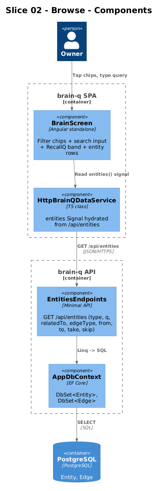
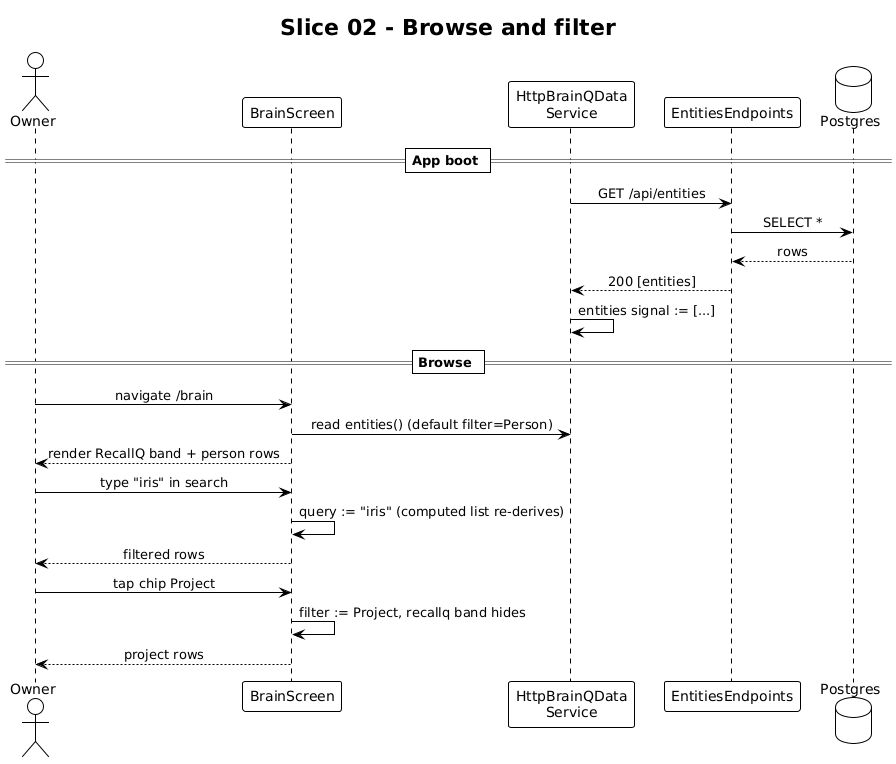

# Slice 02 — Entity Browse

**Traces to:** L2-003 (GET list), L2-005, L2-009, L2-010, L2-027

## 1. Overview

The Brain screen lets the owner filter entities by type, type-substring-search the list, and — when filtered to `Person` — see the RecallQ band (orbit / overdue / close-circle stats and an overdue list). The frontend already implements all of this against the in-memory data; this slice points it at `GET /api/entities`.

## 2. Architecture



### 2.1 Frontend changes

| File | Change |
|---|---|
| `frontend/projects/domain/src/lib/http-data.service.ts` | Hydration `GET /api/entities` already exists from slice 01. Add `refresh()` that re-fetches; called after `capture()` HTTP completes. |
| `frontend/projects/brain-q/src/app/screens/brain/brain.html` | Add `data-testid` attributes on the chip row, search input, list rows, and RecallQ stats. No structural changes. |
| `frontend/projects/brain-q/src/app/screens/brain/brain.ts` | No changes — it consumes the signal already. |

The Brain screen's filter and substring search **stay client-side** for the seed-sized dataset that fits in memory. The server endpoint is still spec'd to support `type`, `q`, pagination, etc. (L2-005) for when scale demands it; the frontend just doesn't surface server-side params yet. This follows L1-012: don't push filters to the server until pagination is needed.

### 2.2 Backend additions

`GET /api/entities` already declared in slice 01's endpoint group; the handler is fleshed out here:

```csharp
public record ListQuery(string? Type, string? Q, Guid? RelatedTo, string? EdgeType,
                        DateTime? From, DateTime? To, int? Take, int? Skip);

private static async Task<IResult> ListAsync(
    [AsParameters] ListQuery q, AppDbContext db, CancellationToken ct)
{
    var query = db.Entities.AsNoTracking().AsQueryable();

    if (!string.IsNullOrWhiteSpace(q.Type))
    {
        var types = q.Type.Split(',').Select(s => Enum.Parse<EntityType>(s, true)).ToArray();
        query = query.Where(e => types.Contains(e.Type));
    }
    if (!string.IsNullOrWhiteSpace(q.Q))
    {
        var needle = q.Q.ToLower();
        query = query.Where(e =>
            EF.Functions.ILike(e.Title, $"%{needle}%") ||
            (e.Body != null && EF.Functions.ILike(e.Body, $"%{needle}%")) ||
            e.Tags.Any(t => t.Contains(needle)));
    }
    if (q.RelatedTo is { } rid)
    {
        var kinds = q.EdgeType?.Split(',') ?? Array.Empty<string>();
        query =
            from e in query
            join edge in db.Edges on e.Id equals edge.ToEntityId
            where edge.FromEntityId == rid &&
                  (kinds.Length == 0 || kinds.Contains(edge.Type.ToString()))
            select e;
    }
    if (q.From is { } from) query = query.Where(e => e.CreatedUtc >= from);
    if (q.To   is { } to)   query = query.Where(e => e.CreatedUtc <= to);

    var take = Math.Clamp(q.Take ?? 50, 1, 200);
    var skip = Math.Max(q.Skip ?? 0, 0);
    var items = await query.OrderByDescending(e => e.UpdatedUtc).Skip(skip).Take(take).ToListAsync(ct);
    return Results.Ok(items.Select(EntityDto.From));
}
```

This is the only structured-query endpoint the system has; the Brain screen ignores most parameters today, but the backend supports them now so future UI iterations are unblocked without an API change.

## 3. Workflow



1. App boots → `HttpBrainQDataService` constructor fires `GET /api/entities` → entities signal hydrates.
2. User navigates to `/brain` (default filter `Person`).
3. Screen reads `entities()` signal → filters to `Person` → renders RecallQ band + entity rows.
4. User types in the search input → `query` signal → list re-derives.
5. User clicks a chip (e.g., `Project`) → `filter` signal → list re-derives, RecallQ band hides.

## 4. API Contract

```
GET /api/entities?type=Person,Project&q=iris&relatedTo=<uuid>&edgeType=mentions&from=2026-01-01&to=2026-12-31&take=50&skip=0

200 OK
[ { "id":"...", "type":"Person", "title":"Iris Okafor", ... }, ... ]
```

Caps: `take` defaults 50, max 200; oversized requests cap silently.

## 5. Acceptance Tests (Playwright POM)

`frontend/e2e/pom/brain.page.ts`:

```ts
export class BrainPage {
  constructor(private page: Page) {}
  goto       = () => this.page.goto('/brain');
  search     = () => this.page.getByTestId('brain-search');
  chip       = (id: 'All'|'Person'|'Project'|'Commitment'|'Note'|'Idea') => this.page.getByTestId(`brain-chip-${id}`);
  rows       = () => this.page.getByTestId('brain-row');
  recallq    = {
    band:    () => this.page.getByTestId('recallq-band'),
    overdue: () => this.page.getByTestId('recallq-overdue').locator('[data-testid^="recallq-overdue-row-"]'),
    statOrbit:   () => this.page.getByTestId('recallq-stat-orbit'),
    statOverdue: () => this.page.getByTestId('recallq-stat-overdue'),
    statClose:   () => this.page.getByTestId('recallq-stat-close'),
  };
}
```

`frontend/e2e/specs/02-browse.spec.ts`:

```ts
test.describe('@slice-02 Browse', () => {
  test('Person filter shows RecallQ band; switching filters hides it', async ({ brainq, seedEntity }) => {
    await seedEntity({ type: 'Person', title: 'Nadia Cole', tags: ['overdue'] });
    await seedEntity({ type: 'Project', title: 'Q-Suite consolidation' });

    await brainq.brain.goto();
    await expect(brainq.brain.recallq.band()).toBeVisible();
    await expect(brainq.brain.recallq.overdue()).toContainText('Nadia Cole');

    await brainq.brain.chip('Project').click();
    await expect(brainq.brain.recallq.band()).toBeHidden();
    await expect(brainq.brain.rows()).toContainText('Q-Suite consolidation');
  });

  test('substring search filters the list', async ({ brainq, seedEntity }) => {
    await seedEntity({ type: 'Person', title: 'Iris Okafor', tags: ['mentor'] });
    await seedEntity({ type: 'Person', title: 'Theo Lindgren' });
    await brainq.brain.goto();
    await brainq.brain.search().fill('iris');
    await expect(brainq.brain.rows()).toHaveCount(1);
    await expect(brainq.brain.rows().first()).toContainText('Iris');
  });

  test('All chip shows every type', async ({ brainq, seedEntity }) => {
    await seedEntity({ type: 'Idea', title: 'Schema as a graph' });
    await brainq.brain.goto();
    await brainq.brain.chip('All').click();
    await expect(brainq.brain.rows()).toContainText('Schema as a graph');
  });
});
```

## 6. Responsive Notes

| Viewport | Layout |
|---|---|
| xs | Single column, chip row scrolls horizontally, search bar above chips |
| md | Two-column row grid, chip row inline |
| xl | Brain context pane on the right (edge type legend + "Most connected") rendered separately |

The Brain screen template is unchanged structurally between viewports; only the column count differs via existing token-driven CSS in `brain.scss`.

## 7. Open Questions

- **Server-side `q` substring search vs. client-side.** Currently client-side; switches to server-side once `entities` signal grows past, say, 5k rows. Track in a follow-up — not this slice.
- **Pagination UI.** API supports `take`/`skip` but no UI surfaces it. Defer until the seed list outgrows a single screen.
