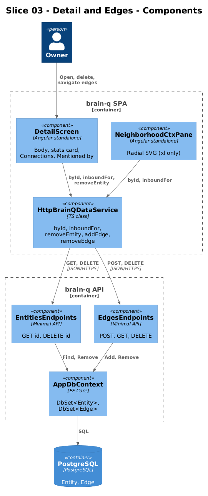
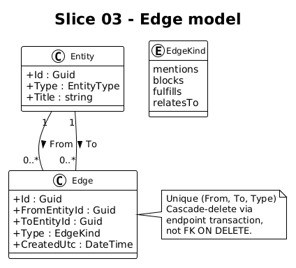
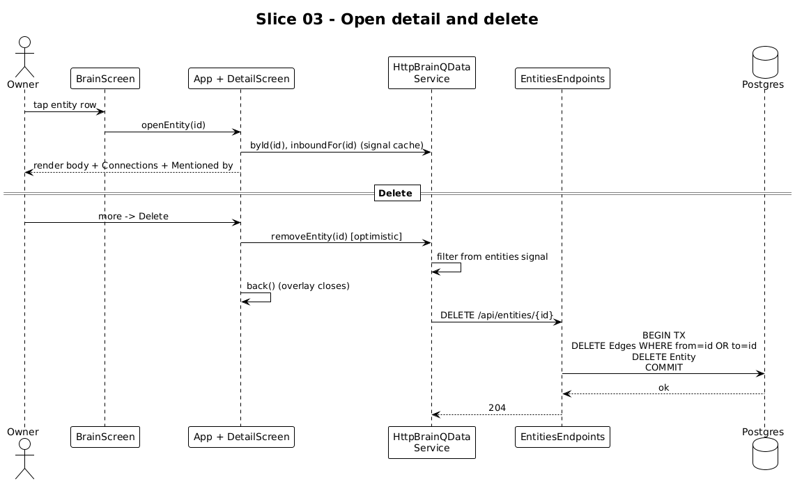

# Slice 03 — Entity Detail + Edges

**Traces to:** L2-002, L2-003 (GET id, DELETE), L2-004, L2-026

## 1. Overview

Open any entity to see its body, type-specific stats card, outbound "Connections" list (edge chips), and inbound "Mentioned by" list. At xl, the right-side context pane renders a radial Neighborhood graph centered on the open entity. This slice wires the Detail screen to real data, adds the edges API, and adds delete affordances on the Detail screen.

## 2. Architecture




### 2.1 Frontend changes

| File | Change |
|---|---|
| `frontend/projects/domain/src/lib/http-data.service.ts` | Add `inboundFor(id)` server-backed; expose `removeEntity(id)`, `removeEdge(id)`, `addEdge(from,to,kind)` |
| `frontend/projects/domain/src/lib/brain-q-data.service.ts` | Add `addEdge`, `removeEdge`, `removeEntity` to the interface |
| `frontend/projects/brain-q/src/app/screens/detail/detail.html` | Add "Delete" item to the existing `more` icon button menu; add `data-testid` hooks |
| `frontend/projects/brain-q/src/app/screens/detail/detail.ts` | Wire `more` menu → calls `data.removeEntity(id)` then closes overlay |
| `frontend/projects/brain-q/src/app/components/context-panes/neighborhood-ctx.html` | Add `data-testid` attributes on graph nodes and the neighbor rows |

The "add edge" UI remains UI-design-pending (see L2-004 note in the spec). The interface and HTTP method exist so a later UI slice doesn't need a contract change.

`HttpBrainQDataService.removeEntity(id)`:

```ts
removeEntity(id: string): void {
  const before = this._entities();
  this._entities.update(xs => xs.filter(e => e.id !== id));
  this.http.delete(`${this.base}/entities/${id}`).subscribe({
    error: () => this._entities.set(before),  // rollback on failure
  });
}
```

### 2.2 Backend additions

`Endpoints/Entities.cs` adds the GET and DELETE handlers; `Endpoints/Edges.cs` is new.

```csharp
// Entities.cs
private static async Task<IResult> GetAsync(Guid id, AppDbContext db, CancellationToken ct)
{
    var e = await db.Entities.AsNoTracking().FirstOrDefaultAsync(x => x.Id == id, ct);
    return e is null ? Results.NotFound() : Results.Ok(EntityDto.From(e));
}

private static async Task<IResult> DeleteAsync(Guid id, AppDbContext db, CancellationToken ct)
{
    using var tx = await db.Database.BeginTransactionAsync(ct);
    var e = await db.Entities.FindAsync([id], ct);
    if (e is null) return Results.NotFound();
    var edges = await db.Edges.Where(x => x.FromEntityId == id || x.ToEntityId == id).ToListAsync(ct);
    db.Edges.RemoveRange(edges);
    db.Entities.Remove(e);
    await db.SaveChangesAsync(ct);
    await tx.CommitAsync(ct);
    return Results.NoContent();
}

// Edges.cs
public static class EdgesEndpoints
{
    public record CreateRequest(Guid FromEntityId, Guid ToEntityId, string Type);

    public static void MapEdgesEndpoints(this IEndpointRouteBuilder app)
    {
        var grp = app.MapGroup("/api/edges");
        grp.MapPost("",  CreateAsync);
        grp.MapGet("",   ListAsync);
        grp.MapDelete("{id:guid}", DeleteAsync);
    }

    private static async Task<IResult> CreateAsync(CreateRequest req, AppDbContext db, CancellationToken ct)
    {
        if (!Enum.TryParse<EdgeKind>(req.Type, out var kind))
            return Results.BadRequest(new { error = "unknown edge type" });
        var fromExists = await db.Entities.AnyAsync(e => e.Id == req.FromEntityId, ct);
        var toExists   = await db.Entities.AnyAsync(e => e.Id == req.ToEntityId, ct);
        if (!fromExists || !toExists) return Results.BadRequest(new { error = "entity not found" });

        try
        {
            var edge = new Edge {
                Id = Guid.NewGuid(), FromEntityId = req.FromEntityId, ToEntityId = req.ToEntityId,
                Type = kind, CreatedUtc = DateTime.UtcNow
            };
            db.Edges.Add(edge);
            await db.SaveChangesAsync(ct);
            return Results.Created($"/api/edges/{edge.Id}", EdgeDto.From(edge));
        }
        catch (DbUpdateException) { return Results.Conflict(new { error = "duplicate edge" }); }
    }
}
```

The unique index on `(FromEntityId, ToEntityId, Type)` lets the conflict surface cleanly without a SELECT-then-INSERT race.

## 3. Workflow



1. User taps an entity row → `App.openEntity(id)` → `AppShellState.openId.set(id)` → overlay renders `<app-detail>`.
2. `<app-detail>` reads `entity = data.byId(id)` from the signal cache.
3. Inbound edges come from the same cache: `data.inboundFor(id)` walks the index built from `entities()`.
4. At xl, `<app-neighborhood-ctx>` renders the radial SVG using the same data.
5. User taps `more` → "Delete" → `data.removeEntity(id)` → optimistic removal from the signal → `DELETE /api/entities/{id}` fires → overlay closes (back).

## 4. API Contracts

```
GET /api/entities/{id}            → 200 EntityDto | 404
DELETE /api/entities/{id}         → 204 | 404
POST /api/edges                   → 201 EdgeDto | 400 (bad type / unknown entity) | 409 (dup)
GET /api/edges?fromId=&toId=&type=  → 200 [EdgeDto]
DELETE /api/edges/{id}            → 204 | 404
```

## 5. Acceptance Tests (Playwright POM)

`frontend/e2e/pom/detail.page.ts`:

```ts
export class DetailPage {
  constructor(private page: Page) {}
  open        = (id: string) => this.page.getByTestId(`brain-row-${id}`).click();
  back        = () => this.page.getByTestId('detail-back').click();
  title       = () => this.page.getByTestId('detail-title');
  connections = () => this.page.getByTestId('detail-connections').locator('[data-testid^="edge-chip-"]');
  mentionedBy = () => this.page.getByTestId('detail-mentioned-by').locator('[data-testid^="brain-row-"]');
  more        = () => this.page.getByTestId('detail-more').click();
  delete      = () => this.page.getByTestId('detail-delete').click();
  graphNode   = (id: string) => this.page.getByTestId(`graph-node-${id}`);
  neighbor    = (id: string) => this.page.getByTestId(`neighbor-row-${id}`);
}
```

`frontend/e2e/specs/03-detail-edges.spec.ts`:

```ts
test.describe('@slice-03 Detail + edges', () => {
  test('outbound + inbound edges render', async ({ brainq, seedGraph }) => {
    const { iris, seamsNote } = await seedGraph(/* Iris mentions seamsNote */);
    await brainq.brain.goto();
    await brainq.detail.open(iris.id);
    await expect(brainq.detail.connections()).toContainText(seamsNote.title);

    await brainq.detail.back();
    await brainq.detail.open(seamsNote.id);
    await expect(brainq.detail.mentionedBy()).toContainText('Iris');
  });

  test('xl: neighborhood graph centers on open entity, click navigates', async ({ brainq, seedGraph, page }) => {
    const { iris, seamsNote } = await seedGraph();
    await page.setViewportSize({ width: 1440, height: 900 });
    await brainq.brain.goto();
    await brainq.detail.open(iris.id);
    await brainq.detail.graphNode(seamsNote.id).click();
    await expect(brainq.detail.title()).toContainText('seam');
  });

  test('delete removes entity and its edges, returns to list', async ({ brainq, seedEntity }) => {
    const note = await seedEntity({ type: 'Note', title: 'temporary thought' });
    await brainq.brain.goto();
    await brainq.detail.open(note.id);
    await brainq.detail.more();
    await brainq.detail.delete();
    await expect(brainq.brain.rows()).not.toContainText('temporary thought');
  });
});
```

## 6. Responsive Notes

| Viewport | Detail surface |
|---|---|
| xs–lg | Detail screen renders inside an overlay over the stage; no graph pane |
| xl | Detail screen in the stage; Neighborhood pane on the right context column with SVG graph |

The radial SVG is laid out by deterministic angle math in `NeighborhoodCtxPane.positioned` — no extra library.

## 7. Open Questions

- **Edit affordance.** Out of scope for this slice (UI design pending per L2-003). When designed, it reuses the same `more` menu and a sheet similar to capture.
- **Confirmation before delete.** Currently the slice deletes immediately with optimistic UI; if the user's expectation is "are you sure?", we add a confirm sheet. Defaulting to no-confirm because optimistic + toast undo is simpler and safer to add later.
