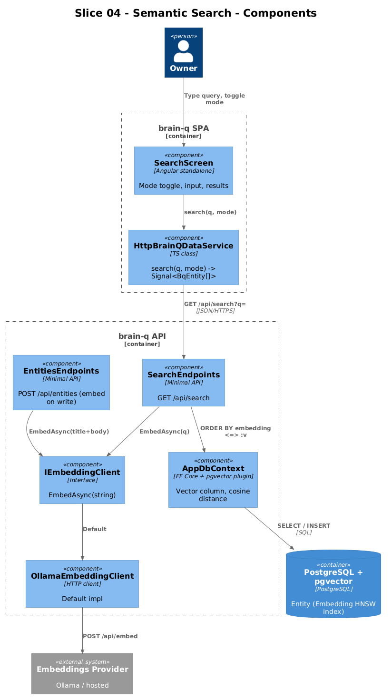
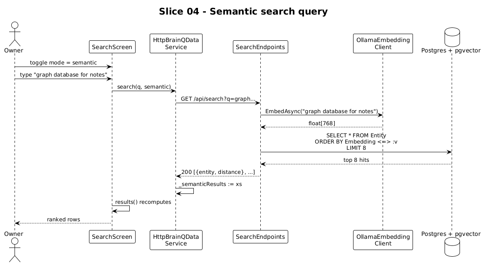

# Slice 04 — Semantic Search

**Traces to:** L2-006, L2-007, L2-012

## 1. Overview

The Search screen has two modes the owner picks one at a time: `structured` (substring match against indexed columns, served locally from the signal cache) and `semantic` (cosine similarity over `pgvector` embeddings via `GET /api/search`). This slice introduces the embedding pipeline on writes and the search endpoint on reads.

## 2. Architecture



### 2.1 Frontend changes

| File | Change |
|---|---|
| `frontend/projects/domain/src/lib/http-data.service.ts` | Replace `search()` body to branch by mode: `structured` reads the local signal (existing logic moved out of the in-memory class into a free function `structuredSearch(entities, q)`), `semantic` calls `GET /api/search` and returns the results |
| `frontend/projects/domain/src/lib/structured-search.ts` | **New** — pure function so both impls share it |
| `frontend/projects/brain-q/src/app/screens/search/search.html` | Add `data-testid` attributes on mode chips, search input, suggestion buttons, result rows |

`HttpBrainQDataService.search`:

```ts
search(query: string, mode: BqSearchMode): readonly BqEntity[] {
  const q = query.trim();
  if (!q) return [];
  if (mode === 'structured') return structuredSearch(this._entities(), q);

  // semantic: kick off and update a per-query signal; return current snapshot
  if (this._lastSemanticQ() !== q) {
    this._lastSemanticQ.set(q);
    this.http.get<BqEntity[]>(`${this.base}/search?q=${encodeURIComponent(q)}`)
      .subscribe(xs => this._semanticResults.set(xs));
  }
  return this._semanticResults();
}
```

Two private signals (`_lastSemanticQ`, `_semanticResults`) deduplicate in-flight queries and feed the same `computed` the screen already reads. The interface return type stays synchronous.

### 2.2 Backend additions

```
backend/BrainQ.Api/
├── Embeddings/
│   ├── IEmbeddingClient.cs         # Task<float[]?> EmbedAsync(string, CancellationToken)
│   ├── OllamaEmbeddingClient.cs    # default; reads OLLAMA_URL + EMBED_MODEL from config
│   └── NullEmbeddingClient.cs      # logs and returns null when configured (graceful degradation)
└── Endpoints/Search.cs              # MapSearchEndpoints + SearchAsync
```

**Embedding on write (L2-006).** The existing `POST /api/entities` from slice 01 grows one line:

```csharp
var embedding = await embed.EmbedAsync($"{title}\n\n{req.Text}", ct);
e.Embedding = embedding is null ? null : new Vector(embedding);
```

Same for PUT (slice tbd) when title or body changes. Failures fall through with `Embedding=null` and a `Warning` log; the entity still saves (L2-006 AC4).

**Search endpoint:**

```csharp
public static class SearchEndpoints
{
    public static void MapSearchEndpoints(this IEndpointRouteBuilder app)
        => app.MapGet("/api/search", SearchAsync);

    private static async Task<IResult> SearchAsync(
        string q, string? type, int? take,
        AppDbContext db, IEmbeddingClient embed, CancellationToken ct)
    {
        if (string.IsNullOrWhiteSpace(q)) return Results.BadRequest(new { error = "q required" });
        var vec = await embed.EmbedAsync(q, ct);
        if (vec is null) return Results.Ok(Array.Empty<EntityDto>());   // provider down -> empty

        var query = db.Entities.Where(e => e.Embedding != null);
        if (!string.IsNullOrWhiteSpace(type))
        {
            var t = Enum.Parse<EntityType>(type, true);
            query = query.Where(e => e.Type == t);
        }
        var v = new Vector(vec);
        var top = await query
            .OrderBy(e => e.Embedding!.CosineDistance(v))
            .Take(Math.Clamp(take ?? 8, 1, 50))
            .Select(e => new SearchHit(EntityDto.From(e), e.Embedding!.CosineDistance(v)))
            .ToListAsync(ct);
        return Results.Ok(top);
    }

    public record SearchHit(EntityDto Entity, double Distance);
}
```

Uses `pgvector-dotnet`'s `Vector` type and the Npgsql plugin. The HNSW or IVFFlat index on `Embedding` is created in the initial migration (L2-001 AC1).

### 2.3 Configuration

```jsonc
// appsettings.json
{
  "Embeddings": {
    "Provider": "Ollama",      // or "Null"
    "Url": "http://localhost:11434",
    "Model": "nomic-embed-text",
    "Dim": 768
  }
}
```

`Dim` flows into the EF Core column type at startup. Slice 04's open question (below) picks this number once.

## 3. Workflow



### 3.1 On write
1. `POST /api/entities` validates → builds `Entity`.
2. Calls `embed.EmbedAsync(title + body)`.
3. Stores `Vector(...)` (or `null` on failure) → `SaveChanges`.

### 3.2 On semantic search
1. User toggles to `semantic`, types a query, presses Enter (or each keystroke after debounce).
2. `HttpBrainQDataService.search` fires `GET /api/search?q=...`.
3. Server embeds the query, runs `ORDER BY embedding <=> :v LIMIT :n`.
4. Results stream into `_semanticResults` signal → screen re-renders.

## 4. API Contract

```
GET /api/search?q=<text>&type=Person&take=8
200 OK
[ { "entity": { "id": "...", "type": "Idea", "title": "Schema as a graph", ... },
    "distance": 0.1234 }, ... ]

400 Bad Request   { "error": "q required" }
```

## 5. Acceptance Tests (Playwright POM)

`frontend/e2e/pom/search.page.ts`:

```ts
export class SearchPage {
  constructor(private page: Page) {}
  goto      = () => this.page.goto('/search');
  input     = () => this.page.getByTestId('search-input');
  modeChip  = (m: 'structured'|'semantic') => this.page.getByTestId(`search-mode-${m}`);
  results   = () => this.page.getByTestId('search-results').locator('[data-testid^="brain-row-"]');
  suggestion = (i: number) => this.page.getByTestId(`search-suggestion-${i}`);
  resultsLabel = () => this.page.getByTestId('search-results-label');
}
```

`frontend/e2e/specs/04-semantic-search.spec.ts`:

```ts
test.describe('@slice-04 Semantic search', () => {
  test('semantic mode hits /api/search and ranks by closeness', async ({ brainq, seedEntity, page }) => {
    await seedEntity({ type: 'Idea',  title: 'Schema as a graph, stored relationally',
                       body: 'typed entities + typed edges' });
    await seedEntity({ type: 'Note',  title: 'Standup',
                       body: 'pgvector is fine up to 200k rows without IVF' });

    const apiCall = page.waitForResponse(r => r.url().includes('/api/search'));
    await brainq.search.goto();
    await brainq.search.modeChip('semantic').click();
    await brainq.search.input().fill('graph database for personal notes');
    await apiCall;

    await expect(brainq.search.resultsLabel()).toHaveText(/closest in meaning/i);
    await expect(brainq.search.results().first()).toContainText('Schema as a graph');
  });

  test('structured mode does not hit /api/search', async ({ brainq, seedEntity, page }) => {
    await seedEntity({ type: 'Person', title: 'Iris Okafor' });
    let semanticCalls = 0;
    page.on('response', r => { if (r.url().includes('/api/search')) semanticCalls++; });

    await brainq.search.goto();
    await expect(brainq.search.modeChip('structured')).toHaveAttribute('aria-pressed', 'true');
    await brainq.search.input().fill('Iris');
    await expect(brainq.search.results()).toContainText('Iris');
    expect(semanticCalls).toBe(0);
  });

  test('empty q gracefully shows the suggestion list', async ({ brainq }) => {
    await brainq.search.goto();
    await expect(brainq.search.suggestion(0)).toBeVisible();
  });
});
```

## 6. Responsive Notes

| Viewport | Search layout |
|---|---|
| xs | Search input sticky at top, mode chips below, results scroll under |
| md | Same, wider container |
| xl | Search context pane on the right (query mode descriptions + operator hints) |

## 7. Open Questions

- **Embedding dimension.** Default `nomic-embed-text` = 768 dims, which matches a free local Ollama. The L2-001 spec text says `vector(1536)` (OpenAI default). Pick **768** to keep dev free; update the spec text in L2-001 to match. If the owner later swaps to a 1536-dim provider, a one-shot migration re-creates the column at the new dim and re-embeds existing rows.
- **Throttling embedding requests on bulk imports.** Out of scope until a bulk-import slice exists.
