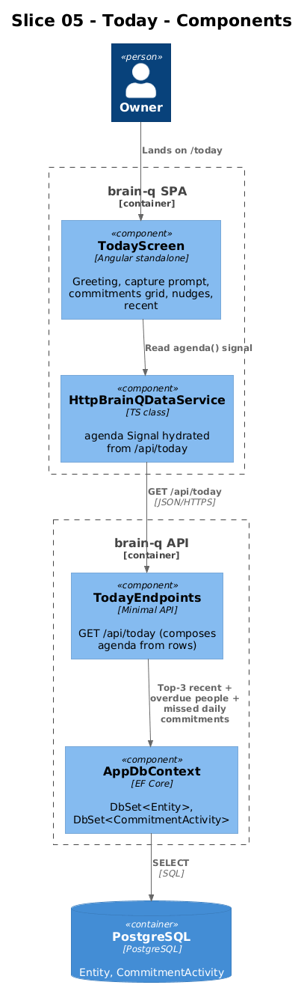
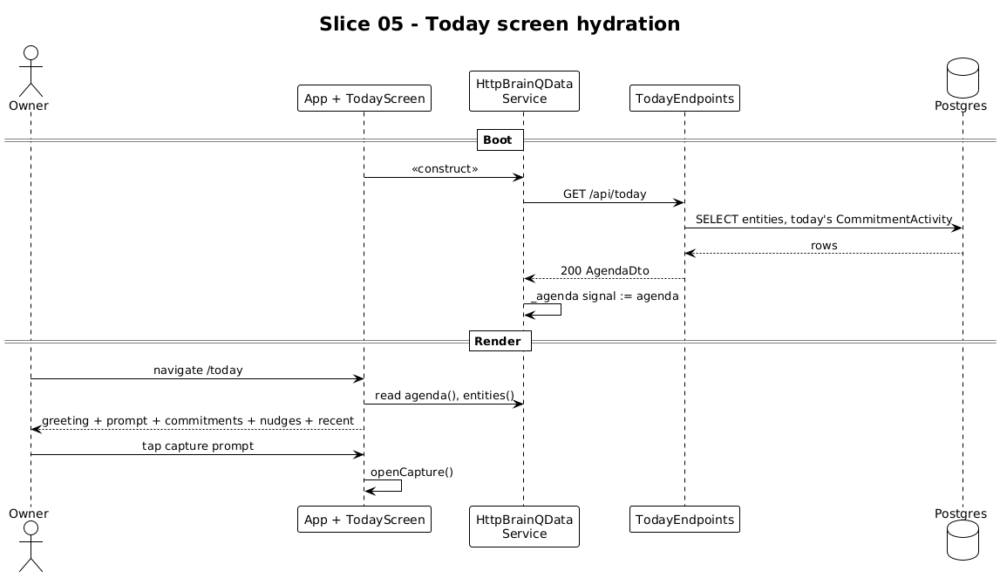

# Slice 05 — Today Surface

**Status:** Accepted (2026-05-02)

**Traces to:** L2-022, L1-013

## 1. Overview

The Today screen orients the owner each session: date label, greeting, capture prompt, Commitments grid, "On your mind" nudges, "Recently touched" list. The frontend already renders this structure against the in-memory data; this slice replaces the seed agenda with a server-derived one and computes the nudges from real data.

## 2. Architecture



### 2.1 Frontend changes

| File | Change |
|---|---|
| `frontend/projects/domain/src/lib/http-data.service.ts` | Add hydration call `GET /api/today` on construction → updates `_agenda` signal |
| `frontend/projects/brain-q/src/app/screens/today/today.html` | Add `data-testid` attributes |

The screen's existing `agenda` signal binding is unchanged. The data shape (`BqAgenda` from `domain/models.ts`) is preserved.

### 2.2 Backend additions

```
backend/BrainQ.Api/Endpoints/Today.cs
```

```csharp
public static class TodayEndpoints
{
    public static void MapTodayEndpoints(this IEndpointRouteBuilder app)
        => app.MapGet("/api/today", GetAsync);

    public record AgendaDto(string Date, string Greeting, string Prompt,
                            string[] Recent, NudgeDto[] Nudges);
    public record NudgeDto(string Id, string Text, string Kind, string EntityId);

    private static async Task<IResult> GetAsync(AppDbContext db, TimeProvider clock, CancellationToken ct)
    {
        var now = clock.GetUtcNow().LocalDateTime;
        var entities = await db.Entities.AsNoTracking().ToListAsync(ct);

        var recent = entities
            .OrderByDescending(e => e.UpdatedUtc)
            .Take(3)
            .Select(e => e.Id.ToString())
            .ToArray();

        var nudges = new List<NudgeDto>();
        foreach (var p in entities.Where(e => e.Type == EntityType.Person && e.Tags.Contains("overdue")))
            nudges.Add(new(Guid.NewGuid().ToString(), $"{p.Title} — worth a message.", "soft", p.Id.ToString()));

        var todayActivity = await db.CommitmentActivities
            .Where(a => a.DateUtc == DateOnly.FromDateTime(now)).Select(a => a.CommitmentEntityId).ToListAsync(ct);
        foreach (var c in entities.Where(e => e.Type == EntityType.Commitment && IsDaily(e) && !todayActivity.Contains(e.Id)))
            nudges.Add(new(Guid.NewGuid().ToString(), $"You haven't logged \"{c.Title}\" today.", "soft", c.Id.ToString()));

        return Results.Ok(new AgendaDto(
            Date: now.ToString("dddd, MMM d"),
            Greeting: GreetingFor(now),
            Prompt: "What's on your mind?",
            Recent: recent,
            Nudges: nudges.ToArray()));
    }

    private static bool IsDaily(Entity e)
        => e.Attributes.RootElement.TryGetProperty("cadence", out var c) && c.GetString() == "daily";

    private static string GreetingFor(DateTime t) => t.Hour switch {
        < 5  => "Quiet night",
        < 12 => "Quiet morning",
        < 17 => "Steady afternoon",
        _    => "Easy evening",
    };
}
```

The endpoint is read-only and side-effect-free; no caching layer (L1-012). The daily-commitment nudge block depends on slice 06's `CommitmentActivity` table; this slice ships with overdue-person nudges only and adds the daily-commitment block once slice 06 lands the table.

## 3. Workflow



1. App boots → http service hydrates `entities` and `agenda` in parallel.
2. User lands on `/today` (default route) → screen reads both signals.
3. Tap capture prompt → `AppShellState.openCapture()` (slice 01 wired).
4. Tap a nudge → `openEntity(nudge.entityId)`.
5. Tap a "Recently touched" row → `openEntity(e.id)`.

## 4. API Contract

```
GET /api/today
200 OK
{ "date": "Friday, May 1", "greeting": "Quiet morning", "prompt": "What's on your mind?",
  "recent": ["<uuid>", "<uuid>", "<uuid>"],
  "nudges": [ { "id":"<uuid>", "text":"Nadia Cole — worth a message.", "kind":"soft", "entityId":"<uuid>" } ] }
```

## 5. Acceptance Tests (Playwright POM)

`frontend/e2e/pom/today.page.ts`:

```ts
export class TodayPage {
  constructor(private page: Page) {}
  goto              = () => this.page.goto('/today');
  greeting          = () => this.page.getByTestId('today-greeting');
  capturePrompt     = () => this.page.getByTestId('today-capture-prompt');
  commitments       = () => this.page.getByTestId('today-commitments').locator('[data-testid^="commitment-cell-"]');
  nudges            = () => this.page.getByTestId('today-nudges').locator('[data-testid^="nudge-"]');
  recentlyTouched   = () => this.page.getByTestId('today-recent').locator('[data-testid^="brain-row-"]');
}
```

`frontend/e2e/specs/05-today.spec.ts`:

```ts
test.describe('@slice-05 Today', () => {
  test('shows greeting, capture prompt, commitments, recent', async ({ brainq, seedEntity }) => {
    await seedEntity({ type: 'Commitment', title: 'Read 30 minutes',
                       attributes: { cadence: 'daily', target: 30, unit: 'min' } });
    await seedEntity({ type: 'Note', title: 'Standup notes' });

    await brainq.today.goto();
    await expect(brainq.today.greeting()).toBeVisible();
    await expect(brainq.today.capturePrompt()).toBeVisible();
    await expect(brainq.today.commitments()).toContainText('Read 30 minutes');
    await expect(brainq.today.recentlyTouched()).toContainText('Standup notes');
  });

  test('overdue person produces a nudge that opens the person on tap', async ({ brainq, seedEntity }) => {
    const nadia = await seedEntity({ type: 'Person', title: 'Nadia Cole', tags: ['overdue'] });
    await brainq.today.goto();
    await expect(brainq.today.nudges()).toContainText('Nadia Cole');
    await brainq.today.nudges().first().click();
    await expect(brainq.detail.title()).toContainText('Nadia Cole');
  });

  test('capture prompt opens the capture sheet', async ({ brainq }) => {
    await brainq.today.goto();
    await brainq.today.capturePrompt().click();
    await expect(brainq.capture.textarea()).toBeFocused();
  });
});
```

## 6. Responsive Notes

| Viewport | Today layout |
|---|---|
| xs | Single column, capture prompt full-width, 2-column commitment grid |
| md | Same single column, slightly wider |
| xl | Today context pane right of stage: "Shape of your brain" + Warm Ideas + Quiet Circles |

## 7. Open Questions

- **Greeting tone.** Currently four hour-bucketed strings. If the owner wants a quieter greeting that reflects yesterday's activity (e.g., "47-day streak"), defer to a follow-up slice.
- **`recent` source.** Currently top-3 by `UpdatedUtc`. Better signal would be a per-entity `LastInteractedUtc` updated whenever the user opens/edits — defer until a UI event tracks it.
