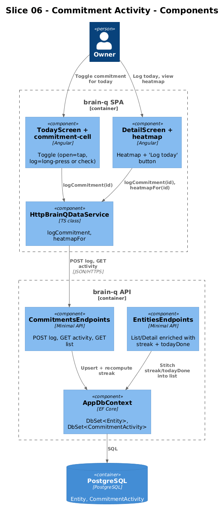
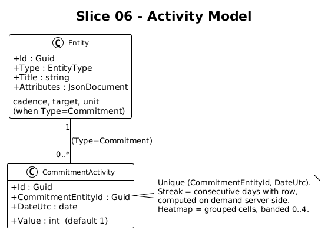
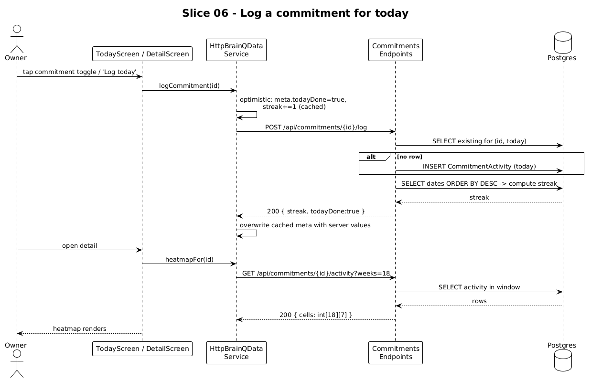

# Slice 06 — Commitment Activity

**Status:** Complete (2026-05-02)

**Traces to:** L2-008, L2-023

## 1. Overview

Commitments need real activity, not seeded numbers: tap a commitment cell on Today (or a "log today" button on its Detail card) → today's row is upserted in `CommitmentActivity` → `streak` and `todayDone` recompute → the heatmap on the Detail screen reflects the change.

## 2. Architecture




### 2.1 Frontend changes

| File | Change |
|---|---|
| `frontend/projects/domain/src/lib/brain-q-data.service.ts` | Add `logCommitment(id, dateUtc?)` to the interface |
| `frontend/projects/domain/src/lib/http-data.service.ts` | Add `logCommitment` impl: optimistic toggle on `meta.todayDone` + signal update; POST `/api/commitments/{id}/log`; rollback on failure |
| `frontend/projects/domain/src/lib/http-data.service.ts` | `heatmapFor(id)` becomes signal-backed; cache populated on first read by `GET /api/commitments/{id}/activity?weeks=18` |
| `frontend/projects/components/src/lib/commitment-cell/commitment-cell.ts` | Add `(toggle)` output emitted on tap-and-hold or a small check tap target on the cell |
| `frontend/projects/brain-q/src/app/screens/today/today.html` | Bind `(toggle)` → `data.logCommitment(c.id)` |
| `frontend/projects/brain-q/src/app/screens/detail/detail.html` | When `entity.type === 'Commitment'`, render a "Log today" button that calls the same |

The `meta.streak` and `meta.todayDone` fields on `BqEntity` are now **derived server-side** and included in every entity GET response (the server computes from the activity log and returns enriched DTO). The frontend treats them as read-only display values; only `logCommitment` mutates them.

### 2.2 Backend additions

```
backend/BrainQ.Api/
├── CommitmentActivity.cs                  # entity class
├── AppDbContext.cs                        # DbSet<CommitmentActivity>
├── Endpoints/Commitments.cs               # MapCommitmentsEndpoints (POST log, GET activity, GET list)
└── Migrations/<timestamp>_CommitmentActivity.cs
```

```csharp
public class CommitmentActivity
{
    public Guid Id { get; set; }
    public Guid CommitmentEntityId { get; set; }
    public DateOnly DateUtc { get; set; }
    public int Value { get; set; } = 1;
}

public static class CommitmentsEndpoints
{
    public static void MapCommitmentsEndpoints(this IEndpointRouteBuilder app)
    {
        app.MapPost("/api/commitments/{id:guid}/log",      LogAsync);
        app.MapGet ("/api/commitments/{id:guid}/activity", ActivityAsync);
        app.MapGet ("/api/commitments",                    ListAsync);
    }

    public record LogResult(int Streak, bool TodayDone);
    public record HeatmapResponse(int[][] Cells);

    private static async Task<IResult> LogAsync(
        Guid id, AppDbContext db, TimeProvider clock, CancellationToken ct)
    {
        var commitment = await db.Entities.FindAsync([id], ct);
        if (commitment is null || commitment.Type != EntityType.Commitment) return Results.NotFound();

        var today = DateOnly.FromDateTime(clock.GetUtcNow().LocalDateTime);
        var existing = await db.CommitmentActivities
            .FirstOrDefaultAsync(a => a.CommitmentEntityId == id && a.DateUtc == today, ct);
        if (existing is null)
            db.CommitmentActivities.Add(new() {
                Id = Guid.NewGuid(), CommitmentEntityId = id, DateUtc = today, Value = 1 });
        await db.SaveChangesAsync(ct);

        var streak = await ComputeStreakAsync(db, id, today, ct);
        return Results.Ok(new LogResult(streak, true));
    }

    private static async Task<int> ComputeStreakAsync(AppDbContext db, Guid id, DateOnly today, CancellationToken ct)
    {
        var dates = await db.CommitmentActivities
            .Where(a => a.CommitmentEntityId == id)
            .Select(a => a.DateUtc)
            .OrderByDescending(d => d)
            .ToListAsync(ct);
        var streak = 0;
        var cursor = today;
        foreach (var d in dates)
        {
            if (d == cursor) { streak++; cursor = cursor.AddDays(-1); }
            else if (d < cursor) break;
        }
        return streak;
    }

    private static async Task<IResult> ActivityAsync(
        Guid id, int? weeks, AppDbContext db, TimeProvider clock, CancellationToken ct)
    {
        var weekCount = Math.Clamp(weeks ?? 18, 1, 52);
        var today = DateOnly.FromDateTime(clock.GetUtcNow().LocalDateTime);
        var startMonday = today.AddDays(-(weekCount * 7) + 1);
        var rows = await db.CommitmentActivities
            .Where(a => a.CommitmentEntityId == id && a.DateUtc >= startMonday)
            .ToListAsync(ct);

        var cells = new int[weekCount][];
        for (int w = 0; w < weekCount; w++)
        {
            cells[w] = new int[7];
            for (int d = 0; d < 7; d++)
            {
                var date = startMonday.AddDays(w * 7 + d);
                var v = rows.FirstOrDefault(r => r.DateUtc == date)?.Value ?? 0;
                cells[w][d] = HeatBand(v);
            }
        }
        return Results.Ok(new HeatmapResponse(cells));
    }

    private static int HeatBand(int v) => v switch { 0 => 0, 1 => 1, <= 2 => 2, <= 4 => 3, _ => 4 };
}
```

`EntityDto.From(e)` is updated to pull a per-entity precomputed activity bundle when `Type == Commitment` so list responses stay simple. The simplest path is one extra query in `EntitiesEndpoints.ListAsync` that fetches all activity rows for commitment ids in the page and stitches `streak`/`todayDone` into the DTOs — radically simple, one round-trip.

## 3. Workflow



1. User taps a Commitment cell's check on Today (or "Log today" on Detail).
2. Frontend optimistically sets `meta.todayDone=true` and `meta.streak += 1` on the cached entity.
3. `POST /api/commitments/{id}/log` fires; server upserts today's row, recomputes streak.
4. Server returns `{ streak, todayDone }`; frontend overwrites the cached fields with authoritative values.
5. If the request fails: revert the optimistic update and toast "Couldn't log — try again".

## 4. API Contracts

```
POST /api/commitments/{id}/log
204-equivalent: 200 OK { "streak": 24, "todayDone": true }
404 when entity missing or not a Commitment.

GET /api/commitments/{id}/activity?weeks=18
200 OK { "cells": [ [ 0,1,2,1,3,4,0 ],   /* week 0, Mon..Sun */
                    [ ... ], ... 18 weeks ] }

GET /api/commitments
200 OK [ EntityDto with meta.streak / meta.todayDone hydrated, ... ]
```

## 5. Acceptance Tests (Playwright POM)

`frontend/e2e/pom/today.page.ts` (extension):
```ts
toggleCommitment = (id: string) => this.page.getByTestId(`commitment-cell-${id}-toggle`).click();
streakOf         = (id: string) => this.page.getByTestId(`commitment-cell-${id}-streak`);
```

`frontend/e2e/specs/06-commitment-activity.spec.ts`:

```ts
test.describe('@slice-06 Commitment activity', () => {
  test('logging today increments streak and reflects on heatmap', async ({ brainq, seedEntity }) => {
    const c = await seedEntity({ type: 'Commitment', title: 'Read 30 minutes',
                                 attributes: { cadence: 'daily', target: 30, unit: 'min' } });

    await brainq.today.goto();
    await expect(brainq.today.streakOf(c.id)).toHaveText('0-day streak · daily');
    await brainq.today.toggleCommitment(c.id);
    await expect(brainq.today.streakOf(c.id)).toHaveText(/1-day streak/);

    await brainq.detail.open(c.id);
    const cells = brainq.detail.heatmapCells();          // [data-testid^="heatmap-cell-"]
    const todayCell = cells.last();
    await expect(todayCell).toHaveAttribute('data-band', /[1-4]/);
  });

  test('double-log of the same day is a no-op (upsert)', async ({ brainq, seedEntity }) => {
    const c = await seedEntity({ type: 'Commitment', title: 'Run or walk',
                                 attributes: { cadence: 'daily', target: 5, unit: 'km' } });
    await brainq.today.goto();
    await brainq.today.toggleCommitment(c.id);
    await brainq.today.toggleCommitment(c.id);          // tap again
    await expect(brainq.today.streakOf(c.id)).toHaveText(/1-day streak/);   // still 1
  });
});
```

## 6. Responsive Notes

| Viewport | Activity surface |
|---|---|
| xs | Toggle is the ring tap target on the cell (44x44 minimum) |
| md | Same; cells in 2-3 column grid |
| xl | Detail screen stat card + heatmap visible alongside Neighborhood pane |

## 7. Open Questions

- **Weekly-cadence streaks.** `cadence=weekly` should mean 1 log per week is enough. Current `ComputeStreakAsync` assumes daily. Slice ships daily-correct; weekly handling lands when the first weekly Commitment is captured (already exists in seed: "Call someone you love"). Track separately.
- **Backfill / undo.** No UI for logging a missed day or undoing a log. Defer.
