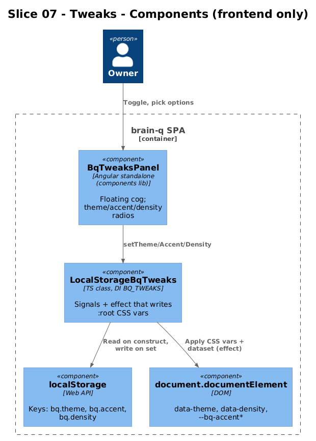
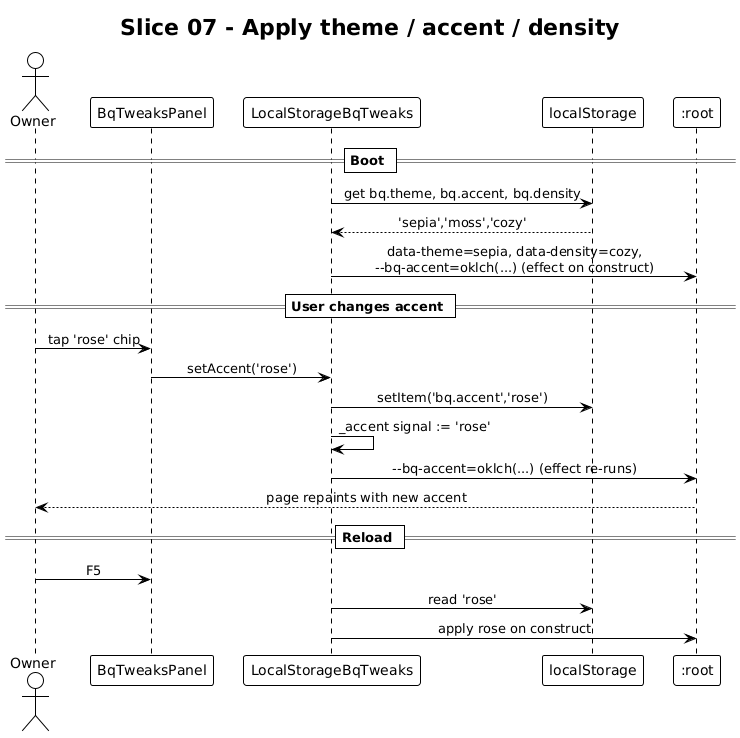

# Slice 07 — Personalization (Tweaks)

**Traces to:** L2-025, L1-014

## 1. Overview

A floating Tweaks panel lets the owner change Theme (`light` / `sepia` / `dark`), Accent (`terracotta` / `ink` / `moss` / `ochre` / `rose`), and Density (`cozy` / `compact`). Selections apply instantly via CSS custom properties on `:root` and persist across reloads in `localStorage`. This slice is **frontend-only** — no API, no DB.

## 2. Architecture



Single new service in the `domain` library, plus a small `BqTweaksPanel` organism in `components/`.

### 2.1 Frontend additions

```
frontend/projects/domain/src/lib/
├── tweaks.service.ts         # NEW — interface + token + impl + provideBqTweaks()
└── (public-api re-exports)

frontend/projects/components/src/lib/tweaks-panel/
├── tweaks-panel.ts           # NEW — bq-tweaks-panel
├── tweaks-panel.html
└── tweaks-panel.scss

frontend/projects/brain-q/src/app/
├── app.config.ts             # add provideBqTweaks()
└── app.html                  # add <bq-tweaks-panel /> alongside the toast
```

### 2.2 Service contract

Same pattern as `BRAIN_Q_DATA`: interface + `InjectionToken<T>` + concrete impl + `provideBqTweaks()`.

```ts
// domain/src/lib/tweaks.service.ts
export type BqTheme   = 'light' | 'sepia' | 'dark';
export type BqAccent  = 'terracotta' | 'ink' | 'moss' | 'ochre' | 'rose';
export type BqDensity = 'cozy' | 'compact';

export interface BqTweaks {
  readonly theme:   Signal<BqTheme>;
  readonly accent:  Signal<BqAccent>;
  readonly density: Signal<BqDensity>;
  setTheme(t: BqTheme): void;
  setAccent(a: BqAccent): void;
  setDensity(d: BqDensity): void;
}

export const BQ_TWEAKS = new InjectionToken<BqTweaks>('BQ_TWEAKS');

@Injectable()
export class LocalStorageBqTweaks implements BqTweaks {
  private readonly _theme   = signal<BqTheme>(read('bq.theme', 'light'));
  private readonly _accent  = signal<BqAccent>(read('bq.accent', 'terracotta'));
  private readonly _density = signal<BqDensity>(read('bq.density', 'cozy'));
  readonly theme   = this._theme.asReadonly();
  readonly accent  = this._accent.asReadonly();
  readonly density = this._density.asReadonly();

  constructor() {
    effect(() => apply(this._theme(), this._accent(), this._density()));
  }

  setTheme   = (t: BqTheme)   => { localStorage.setItem('bq.theme',   t); this._theme.set(t);   };
  setAccent  = (a: BqAccent)  => { localStorage.setItem('bq.accent',  a); this._accent.set(a);  };
  setDensity = (d: BqDensity) => { localStorage.setItem('bq.density', d); this._density.set(d); };
}

export function provideBqTweaks(): EnvironmentProviders {
  return makeEnvironmentProviders([{ provide: BQ_TWEAKS, useClass: LocalStorageBqTweaks }]);
}
```

`apply()` writes `document.documentElement.dataset.theme`, `dataset.density`, and the three accent CSS custom properties (`--bq-accent`, `--bq-accent-soft`, `--bq-accent-ink`) computed from a static `ACCENTS` lookup. This mirrors `applyTheme()` in the existing `docs/design-files/app.jsx`.

### 2.3 Component contract

```ts
// components/src/lib/tweaks-panel/tweaks-panel.ts
@Component({
  selector: 'bq-tweaks-panel',
  changeDetection: ChangeDetectionStrategy.OnPush,
  imports: [BqIconButton],
  templateUrl: './tweaks-panel.html',
  styleUrl: './tweaks-panel.scss',
})
export class BqTweaksPanel {
  private readonly tweaks = inject(BQ_TWEAKS);
  readonly theme   = this.tweaks.theme;
  readonly accent  = this.tweaks.accent;
  readonly density = this.tweaks.density;
  readonly open    = signal(false);

  toggle()                    { this.open.update(v => !v); }
  setTheme(t: BqTheme)        { this.tweaks.setTheme(t); }
  setAccent(a: BqAccent)      { this.tweaks.setAccent(a); }
  setDensity(d: BqDensity)    { this.tweaks.setDensity(d); }
}
```

Renders a fixed-position floating cog (bottom-right on xl, hidden behind the More tab on xs–lg until tapped from the side rail's footer). When open, shows three small radio rows.

## 3. Workflow



1. App boots → `LocalStorageBqTweaks` reads three values from `localStorage` (or defaults).
2. `effect()` runs immediately, applies CSS variables on `:root`.
3. User opens the panel and clicks "moss" accent → `setAccent('moss')` → write to localStorage → signal updates → effect re-applies → CSS variables change → page repaints.
4. Reload: `LocalStorageBqTweaks` reads the persisted values; same paint.

## 4. Acceptance Tests (Playwright POM)

`frontend/e2e/pom/tweaks.page.ts`:

```ts
export class TweaksPage {
  constructor(private page: Page) {}
  toggle    = () => this.page.getByTestId('tweaks-toggle').click();
  theme     = (t: 'light'|'sepia'|'dark')                  => this.page.getByTestId(`tweaks-theme-${t}`);
  accent    = (a: 'terracotta'|'ink'|'moss'|'ochre'|'rose') => this.page.getByTestId(`tweaks-accent-${a}`);
  density   = (d: 'cozy'|'compact')                         => this.page.getByTestId(`tweaks-density-${d}`);
  rootData  = () => this.page.evaluate(() => ({
                       theme:   document.documentElement.dataset.theme,
                       density: document.documentElement.dataset.density,
                       accent:  getComputedStyle(document.documentElement).getPropertyValue('--bq-accent').trim(),
                     }));
}
```

`frontend/e2e/specs/07-tweaks.spec.ts`:

```ts
test.describe('@slice-07 Tweaks', () => {
  test('changing theme writes data-theme on :root', async ({ brainq }) => {
    await brainq.app.goto('/today');
    await brainq.tweaks.toggle();
    await brainq.tweaks.theme('dark').click();
    expect((await brainq.tweaks.rootData()).theme).toBe('dark');
  });

  test('changing accent updates --bq-accent custom property', async ({ brainq }) => {
    await brainq.app.goto('/today');
    await brainq.tweaks.toggle();
    const before = (await brainq.tweaks.rootData()).accent;
    await brainq.tweaks.accent('moss').click();
    const after = (await brainq.tweaks.rootData()).accent;
    expect(after).not.toBe(before);
  });

  test('selections persist across reload', async ({ brainq, page }) => {
    await brainq.app.goto('/today');
    await brainq.tweaks.toggle();
    await brainq.tweaks.density('compact').click();
    await page.reload();
    expect((await brainq.tweaks.rootData()).density).toBe('compact');
  });
});
```

## 5. Responsive Notes

| Viewport | Tweaks panel access |
|---|---|
| xs | Side-rail entry hidden; opens via a small cog in the Today screen footer + bottom-sheet panel |
| md | Same as xs |
| xl | Floating cog button bottom-right; inline panel anchored to the cog |

The panel itself is the same Angular component on every viewport; SCSS handles position. No layout shift between breakpoints.

## 6. Open Questions

- **Sync across devices.** Out of scope (single device by L1-008). If the owner wants this on multiple machines, a tiny `/api/preferences` GET/PUT can replace `localStorage`. Not now.
- **Accent gallery.** Currently five accents to match the existing design files. Adding a custom hex picker doubles the surface; defer.
