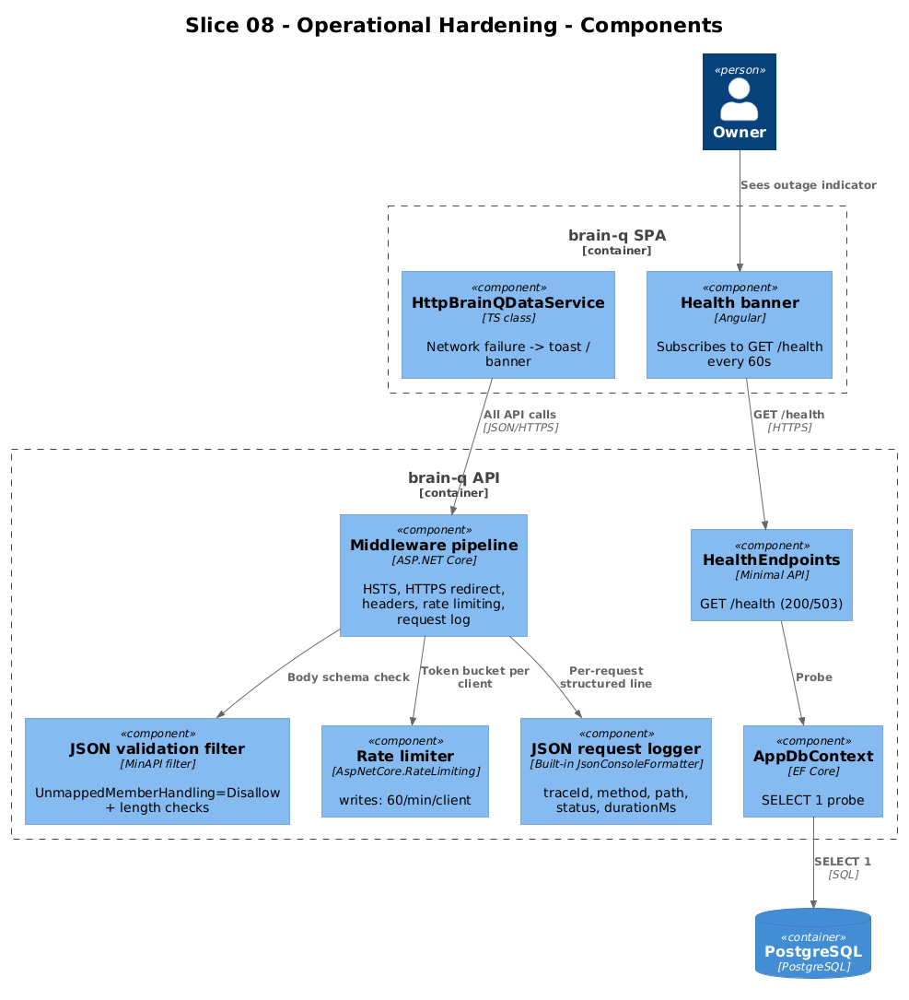

# Slice 08 — Operational Hardening

**Traces to:** L2-015, L2-016, L2-017, L2-018, L2-019

## 1. Overview

Cross-cutting concerns that are not user-facing features but must hold for production: input validation, transport security, rate limiting, performance targets, health, structured logging. This slice is mostly backend; the frontend changes are limited to a `/health` ping and graceful "API unreachable" toasting.

## 2. Architecture



### 2.1 Backend additions

```
backend/BrainQ.Api/
├── Program.cs                          # composition root: middleware order
├── Validation/JsonValidationFilter.cs  # MinAPI endpoint filter for body validation
├── Endpoints/Health.cs                 # GET /health
├── Logging/                            # JSON console logger config (Serilog or built-in JsonConsoleFormatter)
└── Indexes (migrations)                # GIN on Attributes, HNSW on Embedding
```

### 2.2 Validation (L2-015)

Use `System.Text.Json` with `JsonSerializerOptions { UnmappedMemberHandling = Disallow }` registered globally. Endpoint records validate field lengths inline:

```csharp
public record CreateRequest(string Type, string Text)
{
    public IResult? Validate() {
        if (string.IsNullOrWhiteSpace(Text)) return Results.BadRequest(new { error = "text required" });
        if (Text.Length > 100_000)           return Results.BadRequest(new { error = "body >100000" });
        if (!Enum.TryParse<EntityType>(Type, true, out _))
                                              return Results.BadRequest(new { error = $"unknown type '{Type}'" });
        return null;
    }
}
```

XSS — output is JSON-encoded by `System.Text.Json`; the frontend renders text via `{{ ... }}` interpolation (no `[innerHTML]`). The acceptance test confirms `<script>` strings stored in body never execute when fetched and rendered.

### 2.3 Transport (L2-016)

```csharp
if (!app.Environment.IsDevelopment())
{
    app.UseHsts();
    app.UseHttpsRedirection();
    app.Use(async (ctx, next) => {
        ctx.Response.Headers["X-Content-Type-Options"] = "nosniff";
        ctx.Response.Headers["Content-Security-Policy"] = "default-src 'self'; script-src 'self'; style-src 'self' 'unsafe-inline'";
        await next();
    });
}
```

Development bypasses HTTPS; the SPA proxies `/api` over HTTP on localhost.

### 2.4 Rate limiting (L2-017)

Built-in `Microsoft.AspNetCore.RateLimiting`:

```csharp
builder.Services.AddRateLimiter(o => {
    o.AddFixedWindowLimiter("writes", x => {
        x.PermitLimit = 60;
        x.Window = TimeSpan.FromMinutes(1);
        x.QueueLimit = 0;
    });
});

app.MapGroup("/api/entities").RequireRateLimiting("writes")
   .MapPost("", ...).MapPut("{id:guid}", ...).MapDelete("{id:guid}", ...);
```

429 includes `Retry-After`.

### 2.5 Health (L2-019)

```csharp
public static class HealthEndpoints
{
    public static void MapHealthEndpoints(this IEndpointRouteBuilder app)
        => app.MapGet("/health", async (AppDbContext db, CancellationToken ct) =>
        {
            try { await db.Database.ExecuteSqlRawAsync("SELECT 1", ct);
                  return Results.Ok(new { status = "ok", db = "ok" }); }
            catch (Exception ex)
                { return Results.Json(new { status = "down", db = "unreachable", error = ex.Message }, statusCode: 503); }
        });
}
```

### 2.6 Logging (L2-019)

`builder.Logging.AddJsonConsole(o => o.IncludeScopes = true);` plus a request-logging middleware that emits one line per request with `traceId`, `method`, `path`, `status`, `durationMs`. No `ownerId` because L1-008 dropped multi-user.

### 2.7 Performance (L2-018)

Indexes set up in the initial migration:
- `Entity.Attributes` — GIN
- `Entity.Embedding` — HNSW (or IVFFlat if HNSW unsupported on the deployed pgvector)
- `Edge (FromEntityId, ToEntityId, Type)` — unique B-Tree
- `Edge.ToEntityId` — secondary B-Tree (for the inbound query)
- `CommitmentActivity (CommitmentEntityId, DateUtc)` — unique B-Tree

The performance suite (xUnit) seeds 50k entities + 200k edges and asserts the four p95 thresholds; runs in CI nightly, not on every PR.

### 2.8 Frontend additions

| File | Change |
|---|---|
| `frontend/projects/domain/src/lib/http-data.service.ts` | On HTTP 5xx or network error, emit a single "Connection lost — retrying" toast; retry next visible action |
| `frontend/projects/brain-q/src/app/app.ts` | Subscribe to a periodic `GET /health` (every 60s) and show a banner when 503 |

## 3. Acceptance Tests

This slice has both **backend integration** tests (xUnit, hits HTTP) and **Playwright** smoke tests.

`backend/BrainQ.Api.Tests/OpsTests.cs`:

```csharp
// Traces to: L2-015
[Fact] public async Task POST_entities_with_unknown_field_returns_400() { ... }
// Traces to: L2-015
[Fact] public async Task POST_entities_with_oversized_title_returns_400() { ... }
// Traces to: L2-016
[Fact] public async Task Production_response_has_HSTS_CSP_NoSniff_headers() { ... }
// Traces to: L2-017
[Fact] public async Task Sixty_first_write_in_a_minute_returns_429_with_RetryAfter() { ... }
// Traces to: L2-019
[Fact] public async Task GET_health_returns_200_when_db_up() { ... }
[Fact] public async Task GET_health_returns_503_when_db_down() { ... }
// Traces to: L2-018
[Fact] public async Task p95_GET_entities_below_500ms_with_50k_rows() { ... }
```

`frontend/e2e/specs/08-ops.spec.ts`:

```ts
test.describe('@slice-08 Ops', () => {
  test('XSS body does not execute when rendered on detail screen', async ({ brainq, seedEntity }) => {
    const e = await seedEntity({ type: 'Note', title: 'XSS', body: '<script>window.__pwn=1</script>' });
    await brainq.detail.open(e.id);
    expect(await brainq.app.page.evaluate(() => (window as any).__pwn)).toBeUndefined();
  });

  test('API down banner appears when /health returns 503', async ({ brainq, downstream }) => {
    await downstream.killApi();
    await brainq.app.goto('/today');
    await expect(brainq.app.healthBanner()).toBeVisible();
  });
});
```

## 4. Responsive Notes

The "Connection lost" toast/banner uses the existing `bq-toast` for transient errors and a slim banner above the tab bar (`<bq-banner>` — small new component) for sustained outages. Both flow through breakpoints unchanged.

## 5. Open Questions

- **Logging sink.** JSON to stdout for now; a hosted aggregator (Seq, Loki, etc.) is a deployment decision, not a design one. Defer.
- **Performance test cadence.** Nightly is the cheapest place to keep p95 honest; if CI minutes grow expensive, gate on a smaller dataset with proportionally lower thresholds.
- **CSP nonces.** The current CSP allows `'unsafe-inline'` styles to keep things simple. If a stricter policy is required, switch the SCSS pipeline to extract critical inline styles and add nonces — not now.
