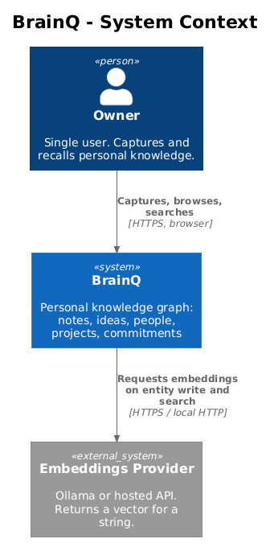
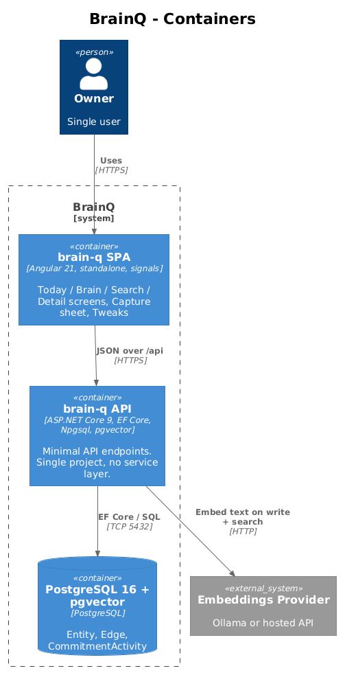
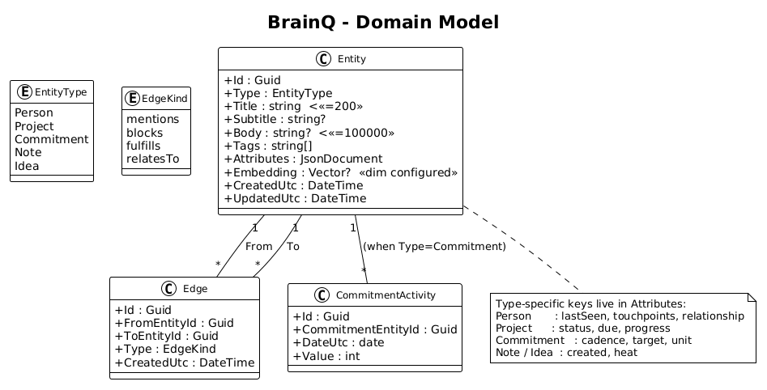

# Shared Architecture — Detailed Design

System-wide context for every slice. Read this once before the per-slice docs.

## 1. Overview

BrainQ is a single-user personal knowledge graph (L1-001, L1-008). One person captures notes, ideas, projects, people, and commitments through one Angular SPA, against one ASP.NET Core API, against one PostgreSQL database with the `pgvector` extension. There is no multi-user model, no microservices, no message broker, no cache (L1-012, L2-020).

## 2. Architecture

### 2.1 System Context


The system has one human user (the owner) and one external dependency: an embeddings provider (e.g., a local Ollama instance or a hosted API). All other behaviour is internal.

### 2.2 Containers


Three containers:

- **brain-q SPA** (Angular 21, standalone components, signals). Built from the existing `frontend/projects/brain-q` app.
- **brain-q API** (ASP.NET Core minimal API, EF Core 9, Npgsql, `pgvector` Npgsql plugin). One project.
- **PostgreSQL 16 + pgvector**. One database. Tables: `Entity`, `Edge`, `CommitmentActivity`. No others until a requirement forces them.

### 2.3 Domain Model


`Entity` is the single canonical row for any kind of knowledge. Type-specific shape lives in the `Attributes` JSONB column (L2-001). `Edge` is the only relationship table (L2-002). `CommitmentActivity` is the only auxiliary table (L2-023).

## 3. Frontend Architecture

### 3.1 Existing layout (preserved)

```
frontend/projects/
├── components/   # @brainq/components — atoms/molecules/organisms, prefix `bq`, tokens-only styling
├── domain/       # exposes BrainQDataService interface + BRAIN_Q_DATA token + provideBrainQDomain()
└── brain-q/      # the application: screens, context panes, capture sheet, app shell
```

`brain-q` imports only the public API of `domain` and `components`. It never imports a concrete implementation — that's why swapping the in-memory implementation for an HTTP one is a one-line change in `app.config.ts`.

### 3.2 New: HTTP-backed data service

Add a second implementation of `BrainQDataService` in the `domain` library:

```
frontend/projects/domain/src/lib/
├── brain-q-data.service.ts        # interface + BRAIN_Q_DATA token  (unchanged)
├── in-memory-data.service.ts      # kept for unit tests + Storybook + offline dev
├── http-data.service.ts           # NEW — talks to /api over HttpClient
├── provide-domain.ts              # provideBrainQDomain() + provideBrainQHttpDomain()
├── models.ts                      # unchanged
└── api-base-url.token.ts          # NEW — InjectionToken<string> for the API root
```

Two providers, picked at app composition root:

```ts
// app.config.ts (production)
providers: [provideBrainQHttpDomain({ baseUrl: '/api' })]

// app.config.ts (offline dev / Storybook)
providers: [provideBrainQDomain()]
```

The interface stays synchronous on its read methods (returning `Signal<readonly BqEntity[]>` etc.). The HTTP implementation maintains an internal `signal<readonly BqEntity[]>` cache that is hydrated by a single `GET /api/entities` on construction and updated optimistically on writes. The screens do not change.

### 3.3 Patterns that continue

| Concern | Pattern |
|---|---|
| Domain contract | `interface` + `InjectionToken<T>` (e.g., `BRAIN_Q_DATA`) |
| Provider wiring | `EnvironmentProviders` from `makeEnvironmentProviders([...])` in a `provide*()` function |
| Component contracts | `input()`, `output()`, `model()` with `ChangeDetectionStrategy.OnPush` |
| State | Angular signals (`signal`, `computed`, `effect`) — no NgRx |
| Styles | Design tokens only (CSS custom properties) from `components/styles/tokens.scss`; component SCSS is layout/spacing only |
| Library prefix | `bq` for `components`, `app` for `brain-q` |

### 3.4 New cross-cutting frontend tokens

| Token | Type | Provided by | Used for |
|---|---|---|---|
| `BRAIN_Q_DATA` | `BrainQDataService` | `provideBrainQDomain*()` | All entity reads/writes (existing) |
| `API_BASE_URL` | `string` | `provideBrainQHttpDomain({ baseUrl })` | HTTP impl base URL |
| `BQ_TWEAKS` | `BqTweaksService` | `provideBqTweaks()` | Theme/accent/density preferences (slice 07) |

## 4. Backend Architecture

### 4.1 Project layout

```
backend/
├── BrainQ.Api/              # ASP.NET Core minimal API + EF Core
│   ├── Program.cs           # composition root: DI, middleware, endpoints
│   ├── AppDbContext.cs      # DbSet<Entity>, DbSet<Edge>, DbSet<CommitmentActivity>
│   ├── Endpoints/           # one file per resource: Entities.cs, Edges.cs, Search.cs, ...
│   ├── Embeddings/          # IEmbeddingClient + OllamaEmbeddingClient
│   └── Migrations/
└── BrainQ.Api.Tests/        # xUnit + WebApplicationFactory for backend integration tests
```

No services layer, no repository layer, no AutoMapper. Endpoint handlers receive `AppDbContext` directly.

### 4.2 The one cross-cutting interface: `IEmbeddingClient`

The embeddings provider is the only place where a real second implementation is plausible (Ollama vs. OpenAI vs. a fake for tests). It gets an interface and a DI registration. Everything else is a concrete class.

```csharp
public interface IEmbeddingClient
{
    Task<float[]?> EmbedAsync(string text, CancellationToken ct);
}
```

### 4.3 Conventions

- All endpoints live in static classes with one extension method `MapXxxEndpoints(this IEndpointRouteBuilder)`.
- DTOs are `record` types in the same file as the endpoints they belong to.
- Validation is `MinimalApi` filter or inline `if (...) return Results.BadRequest(...)` — no FluentValidation.
- Null/length validation per L2-015 lives in the DTO record's constructor or the inline check.

## 5. Test Strategy

ATDD pyramid for this project:

```
        Playwright e2e (POM)         ← truth, slice acceptance
       /                     \
  Frontend unit            Backend integration
  (Vitest, signals)        (xUnit + WAF + Postgres in Docker)
```

- **Playwright e2e** drives the full stack: API + DB + SPA. One slice = one `*.spec.ts`.
- **Backend integration** tests run against a Postgres test container; per L2-021, every test starts with `// Traces to: L2-XXX`.
- **Frontend unit** tests cover signal-derived state in screens/components when worth it.

Playwright layout:

```
frontend/e2e/
├── playwright.config.ts            # 3 viewport projects: xs(375), md(768), xl(1440)
├── fixtures/
│   ├── api.fixture.ts              # spawns the .NET API + resets DB per test
│   └── app.fixture.ts              # exposes pages + page objects
├── pom/
│   ├── app-shell.page.ts           # tab bar, side rail, capture button
│   ├── today.page.ts
│   ├── brain.page.ts
│   ├── search.page.ts
│   ├── detail.page.ts
│   ├── capture-sheet.page.ts
│   └── tweaks.page.ts
└── specs/
    ├── 01-capture.spec.ts
    ├── 02-browse.spec.ts
    └── ...
```

Page Objects expose semantic methods (`await capture.typeBody('met Iris...')`) and locators by `data-testid`, never by class name. Each slice doc lists the exact page object and `data-testid` additions it needs.

## 6. Open Questions

- **Embeddings provider for dev.** Default to a local Ollama running `nomic-embed-text` (768-dim) or accept a 1536-dim cloud embedding? L2-001 currently says `vector(1536)` — slice 04 will pick one and the schema will follow.
- **Optimistic vs. pessimistic capture write.** Slice 01 designs optimistic (entity appears immediately, then reconciles). If the server rejects (validation failure), we roll back — does that need a visible "save failed" state, or is the optimistic one fine? Default: visible toast on failure, slice 01 covers it.
- **Where does `provideBrainQHttpDomain` live?** Inside `domain/` keeps it co-located but pulls `HttpClient` into the domain library's peer deps. Fine — `HttpClient` is `@angular/common/http`, already a project dep.
